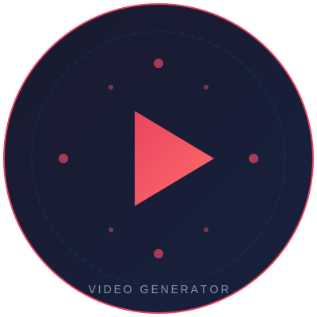
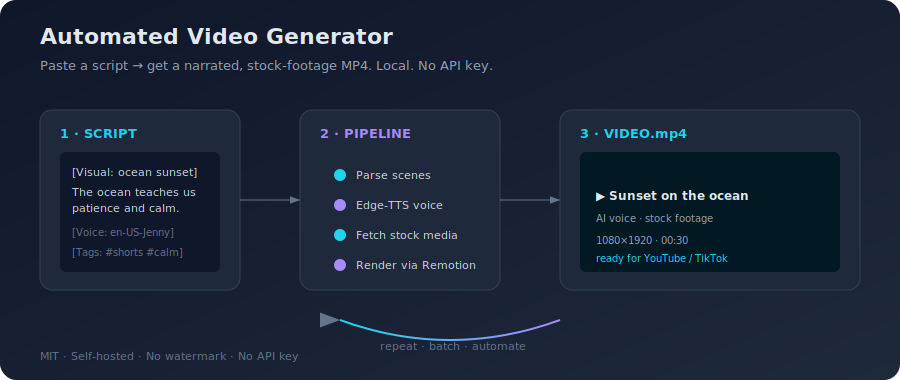
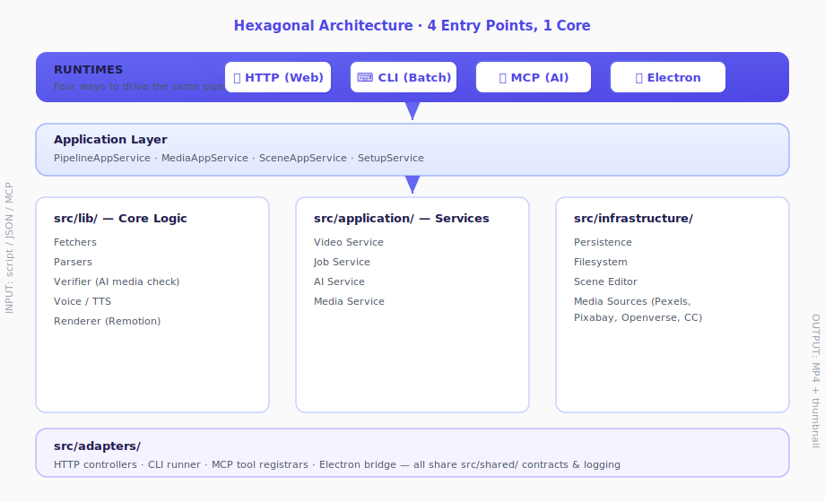

<!--
🧠 Automated Video Generator
   SEO keywords: automated video generator, free video generator, open source video generator,
   ai video generator, text to video, remotion, edge tts, youtube shorts generator, tiktok
   video generator, faceless youtube, content automation, self hosted video generator,
   mcp server, model context protocol, stock media, pexels, pixabay, openverse, video pipeline,
   react video, nodejs video, typescript video, batch video generation, voiceover, text to speech,
   video creator, marketing video, explainer video, shorts automation, reels generator,
   open source, MIT license, programmatic video, no api key, cc images
-->

<div align="center">
  <video src="assets/demo/demo-landscape.mp4" width="100%" controls preload="metadata" style="border-radius: 12px; box-shadow: 0 4px 24px rgba(0,0,0,0.25);">
    Your browser does not support the video tag. <a href="assets/demo/demo-landscape.mp4">Download MP4</a>
  </video>
</div>

<br/>

<div align="center">
  
  <h1>Automated Video Generator</h1>
  <p><strong>🆓 Free &bull; 🔓 Open Source &bull; 🏠 Self-Hosted &bull; 🤖 AI Text-to-Video</strong></p>
  <p><b>Turn any script into a narrated, stock-footage video in minutes.</b><br/>No API key. No watermark. Runs 100% on your machine.</p>
</div>

<br/>

<div align="center">
  <a href="https://github.com/itsPremkumar/Automated-Video-Generator/stargazers"></a>
  <a href="https://github.com/itsPremkumar/Automated-Video-Generator/blob/main/LICENSE"></a>
  <a href="https://github.com/itsPremkumar/Automated-Video-Generator/actions/workflows/ci.yml"></a>
  <a href="https://www.npmjs.com/package/automated-video-generator"></a>
  <a href="https://nodejs.org/"></a>
  <a href="https://github.com/itsPremkumar/Automated-Video-Generator/blob/main/CONTRIBUTING.md"></a>
  <a href="https://github.com/itsPremkumar/Automated-Video-Generator/releases/latest"></a>
  <a href="https://github.com/sponsors/itsPremkumar"></a>
</div>

<div align="center">
  <a href="https://star-history.com/#itsPremkumar/Automated-Video-Generator&Date"></a>
</div>

<br/>

---

## 📖 What is this?

**Automated Video Generator** is a free, open-source, self-hosted pipeline that converts text scripts into polished MP4 videos. Give it a script — it fetches relevant stock visuals, generates natural voiceovers, synchronizes everything with Remotion, and exports a ready-to-share video.

No paid plans. No watermarks. No monthly limits. Just your machine, your scripts, and full control.

<br/>

<div align="center">
  <table>
    <tr>
      <td align="center"><b>🎬 Input</b></td>
      <td align="center"><b>⚙️ Pipeline</b></td>
      <td align="center"><b>📦 Output</b></td>
    </tr>
    <tr>
      <td align="center">Text script<br/>or JSON job<br/>or AI prompt</td>
      <td align="center">Parse → Fetch media<br/>→ Generate voiceover<br/>→ Render with Remotion</td>
      <td align="center">MP4 video<br/>+ Thumbnail<br/>+ Scene data</td>
    </tr>
  </table>
</div>

<br/>

---

## ✨ Demo

> A real short generated by the pipeline (no re-render, no edits) — script in, MP4 out:

<div align="center">
  <table>
    <tr>
      <td width="50%" align="center"><b>📱 Portrait (9:16)</b><br/><small>Reels, Shorts, TikTok</small></td>
      <td width="50%" align="center"><b>🖥️ Landscape (16:9)</b><br/><small>YouTube, presentations</small></td>
    </tr>
    <tr>
      <td align="center">
        <video src="assets/demo/demo-portrait.mp4" width="65%" controls preload="metadata" style="border-radius: 12px; box-shadow: 0 4px 24px rgba(0,0,0,0.25);">
          Your browser does not support the video tag. <a href="assets/demo/demo-portrait.mp4">Download MP4</a>
        </video>
      </td>
      <td align="center">
        <video src="assets/demo/demo-landscape.mp4" width="100%" controls preload="metadata" style="border-radius: 12px; box-shadow: 0 4px 24px rgba(0,0,0,0.25);">
          Your browser does not support the video tag. <a href="assets/demo/demo-landscape.mp4">Download MP4</a>
        </video>
      </td>
    </tr>
  </table>
  <br/>
  <em>🎙️ Voiceover generated with <b>Voicebox Kokoro Heart</b> — realistic AI narration, fully local. 32/32 quality checks passed. No watermark, no API key.</em>
</div>

<div align="center">
  
  <br/>
  <em>Script → AI voiceover + stock media → MP4. Fully local.</em>
</div>

<hr/>

## 🚀 Quick Start (5 minutes)

Choose your path:

| Path                                               | Time  | Difficulty | For           |
| -------------------------------------------------- | ----- | ---------- | ------------- |
| [Windows Desktop App](#windows-desktop-app)       | 2 min | ★☆☆        | Everyone      |
| [One-Click Launcher](#one-click-launcher-windows) | 3 min | ★☆☆        | Windows users |
| [Manual Setup](#manual-setup)                     | 5 min | ★★☆        | Developers    |
| [Docker](#docker)                                 | 3 min | ★★☆        | DevOps        |
| [npm (MCP)](#npm-mcp-server)                      | 1 min | ★☆☆        | AI agents     |

### 🎬 Your first video in 2 commands

No API key required — Openverse finds stock footage automatically; voiceover uses Edge-TTS.

```bash
# 1. Install (one time)
npm install

# 2. Generate (reads input/scripts/input-scripts.json, writes output/<id>/<Title>.mp4)
npm run generate
```

That's it. The CLI reads `input/scripts/input-scripts.json` (a sample job is pre-included) and renders an MP4 with AI voiceover + stock visuals + burned-in captions. With the bundled sample, find it at `output/pre7_productivity_tip/One Simple Trick To Beat Procrastination.mp4`.

Prefer a GUI? Run `npm run dev` and open **http://localhost:3001** — paste a script, click **Generate Video**.

<div align="center">
  <video src="assets/demo/demo-wide.mp4" width="80%" controls preload="metadata" style="border-radius: 12px; box-shadow: 0 4px 24px rgba(0,0,0,0.25);">
    Your browser does not support the video tag. <a href="assets/demo/demo-wide.mp4">Download MP4</a>
  </video>
  <br/>
  <em>Real Voicebox-narrated video from the pipeline. Script → voiceover + stock media → MP4, fully local.</em>
</div>

### 🪟 Windows Desktop App

**No Node.js, Python, or terminal required.**

Download the [latest Windows installer](https://github.com/itsPremkumar/Automated-Video-Generator/releases/latest), double-click, and the app opens the web portal automatically. Everything is bundled.

### 📜 One-Click Launcher (Windows)

```powershell
.\Start-Automated-Video-Generator.bat
```

Or the PowerShell version:

```powershell
.\Start-Automated-Video-Generator.ps1
```

The launcher auto-installs Node.js and Python (via `winget`), creates `.env`, installs dependencies, and opens the portal at `http://localhost:3001`.

### 🛠️ Manual Setup

**Prerequisites:** Node.js 18+, Python 3.8+, npm

```bash
# 1. Clone
git clone https://github.com/itsPremkumar/Automated-Video-Generator.git
cd Automated-Video-Generator

# 2. Install Node dependencies
npm install

# 3. Install Python voice engine
pip install -r requirements.txt

# 4. Configure environment
cp .env.example .env
# Edit .env — add PEXELS_API_KEY (free, get one at pexels.com/api)
# No API key? Set OPENVERSE_ENABLED=true (it's the default)

# 5. Start the web portal
npm run dev
```

Open **http://localhost:3001/** — paste a script, click generate, and watch it render.

### 🐳 Docker

Pre-built image (built + scanned by CI, pushed to GHCR):

```bash
docker run -p 3001:3001 \
  -v "$(pwd)/input:/app/input" \
  -v "$(pwd)/output:/app/output" \
  ghcr.io/itspremkumar/automated-video-generator
```

Or build locally (pinned `node:20-bookworm`, full `npm ci`, edge-tts in a
venv to satisfy PEP 668, platform `linux/amd64`, healthcheck on `/api/health`):

```bash
docker compose up --build
```

### 🚀 Production Deployment

The container is self-contained: it bundles the ffmpeg/ffprobe static
binaries and a Python venv with `edge-tts` for free, key-less narration.
No external services are required for the default pipeline.

**Environment variables (all optional — sensible free defaults):**

| Var | Default | Purpose |
|-----|---------|---------|
| `PORT` | `3001` | Web portal / API port |
| `PEXELS_API_KEY` | _(none)_ | Free stock video. Without it, falls back to Openverse / Wikimedia / Internet Archive. |
| `YOUTUBE_API_KEY` | _(none)_ | YouTube metadata enrichment (optional). |
| `OPENVERSE_ENABLED` | `true` | Use Openverse CC media when no API key is set. |
| `TTS_PROVIDER` | `edge-tts` | `edge-tts` (free, CPU) or `voicebox` (optional local GPU engine). |
| `VOICEBOX_ENGINE` | _(none)_ | `kokoro` or `chatterbox_turbo` — only when `TTS_PROVIDER=voicebox`. |
| `VOICEBOX_PROFILE_ID` | _(none)_ | A Voicebox profile id (preset or cloned voice). |

**Optional: Voicebox GPU voice-clone (opt-in, never blocking).**
Voicebox is a separate, locally-run headless TTS engine (MIT). It is
**disabled by default** — the pipeline uses Edge-TTS (free, CPU) and only
switches to Voicebox if `TTS_PROVIDER=voicebox` is explicitly set and a
backend is reachable. If the backend is unavailable, it degrades gracefully
back to Edge-TTS. On this project's dev laptop (RTX 3050 4 GB, CUDA
12.6) Kokoro uses ~819 MB VRAM and Chatterbox-Turbo ~3.8 GB; CPU-only
is not recommended (OOM). See `docs/VOICE_CLONING_GUIDE.md`.

**Health & hardening:**
- Healthcheck hits `GET /api/health` (container `HEALTHCHECK`).
- No secrets are logged; output paths are sanitized against `../` traversal
  at the dispatch chokepoint (`src/agentic/operations/security.ts`).
- CI runs `typecheck` + `test:unit` + a Gitleaks secret scan + a Docker
  build/push to GHCR on every push to `main`.


The MCP server lets AI agents (Claude Desktop, Claude Code, Cursor, etc.) create videos autonomously — it exposes 23 tools, 13 resources, and 4 prompts over stdio.

**Quick connect (read-only safe mode — default):**

```json
{
    "mcpServers": {
        "automated-video-generator": {
            "command": "npx",
            "args": ["automated-video-generator"]
        }
    }
}
```

Or run it locally:

```bash
npm install
npm run mcp        # starts the MCP server on stdio
```

**⚠️ Safe mode (important):** By default the MCP server runs in **safe mode** — read tools (`read_input_script`, `list_output_videos`, `health_check`, etc.) work, but **all write/mutation tools are blocked** with `ForbiddenError: safe mode`. This protects your files from accidental changes by an agent.

To enable write tools (`write_input_script`, `delete_*`, `upload_asset`, `update_env_config`, `run_pipeline_command`, `delete_output`), set the flag:

```bash
# one-off
ALLOW_UNSAFE_MCP_TOOLS=1 npm run mcp

# or in your client config (env)
{
  "mcpServers": {
    "automated-video-generator": {
      "command": "npx",
      "args": ["automated-video-generator"],
      "env": { "ALLOW_UNSAFE_MCP_TOOLS": "1" }
    }
  }
}
```

> Only enable `ALLOW_UNSAFE_MCP_TOOLS` for trusted agents — it grants filesystem write access to your project.

**What the server provides:**

- **Tools (60):** `write_input_script`, `read_input_script`, `delete_input_script`, `validate_input_script`, `upload_asset`, `delete_asset`, `list_output_videos`, `read_output_file`, `delete_output`, `generate_video`, `get_video_status`, `run_pipeline_command`, `list_jobs`, `get_batch_status`, `read_env_config`, `update_env_config`, `get_system_info`, `health_check`, `get_workspace_paths`, `list_public_files`, `list_voices`, `list_local_assets`, `search_free_video`, `download_free_video`, `agentic_plan`, `agentic_acquire`, `agentic_verify_all`, `list_pending_assets`, `get_asset_preview`, `approve_asset`, `reject_asset`, `agentic_gate`, `agentic_run`, `do_task`, `merge_videos`, `trim_video`, `crop_video`, `resize_video`, `rotate_video`, `extract_audio`, `split_video`, `add_captions`, `add_music`, `add_audio_track`, `localize_video`, `grade_video`, `slow_motion`, `speed_ramp`, `add_watermark`, `add_lower_third`, `add_progress_bar`, `derive_outputs`, `make_voiceover`, `download_image`, `download_video`, `remove_silence`, `detect_scenes`, `auto_reframe`, `reduce_noise`, `apply_brand_kit`
- **Resources (9):** project overview, input scripts, input assets, input format docs, output videos, per-video detail, public tree, env/pipeline config
- **Prompts (4):** `create-marketing-video`, `create-youtube-short`, `batch-generate`, `debug-pipeline`

---

## 🎯 Generate Your First Video

### CLI Batch Mode

Create `input/scripts/input-scripts.json`:

```json
[
    {
        "id": "my-first-video",
        "title": "3 Productivity Habits That Actually Work",
        "orientation": "portrait",
        "language": "english",
        "script": "Here are three productivity habits that will change your life. First, start your day with a clear plan..."
    }
]
```

Run:

```bash
npm run generate
```

Output: `output/my-first-video/final.mp4` 🎉

### Web Portal

```bash
npm run dev
# Open http://localhost:3001
```

The portal lets you paste scripts, configure voice/language/orientation, track rendering progress live, and watch/download the result — all from your browser.

### Director Mode

Use `[Visual: ...]` tags for frame-perfect scene control:

```json
{
    "id": "director-mode-demo",
    "title": "My Directed Video",
    "script": "[Visual: a serene mountain lake at sunset, cinematic, slow pan]\nNestled in the heart of the Rockies, this view has inspired explorers for centuries."
}
```

---

## 🌟 Key Features

| Feature                      | Description                                                                                     |
| ---------------------------- | ----------------------------------------------------------------------------------------------- |
| **🎤 400+ Voices**           | Multi-language TTS via Edge-TTS with fallback to Windows offline speech, Voicebox, XTTS, Kokoro |
| **🖼️ Stock Media**           | Pexels + Pixabay + Openverse (CC images, no API key) + Wikimedia Commons + Internet Archive     |
| **🎵 Background Music**      | Auto-ducking with volume control                                                                |
| **🔄 Batch Processing**      | Generate dozens of videos from one JSON file                                                    |
| **🖥️ Web Portal**            | Browser-based UI for generation, preview, download                                              |
| **🤖 MCP Server**            | Connect Claude Desktop / Claude Code for AI-driven video creation                               |
| **✅ AI Media Verification** | Validates visuals match scene context via Ollama moondream or Gemini Vision                     |
| **🪟 Desktop App**           | Standalone Windows .exe with bundled runtime                                                    |
| **📱 Portrait + Landscape**  | YouTube Shorts, TikTok, Reels, and widescreen support                                           |
| **↩️ Resumable Rendering**   | Cancel and resume without losing progress                                                       |
| **🎬 Remotion Studio**       | Preview and tweak video compositions                                                            |

---

## 🧠 AI Visual Media Verification

After fetching media from stock sources, the pipeline verifies each image/frame against the scene description using a local vision model:

1. Image → base64 (or FFmpeg extracts a video frame)
2. Sent to Ollama (`moondream`) or Gemini Vision with a JSON verdict prompt
3. Low-confidence matches (< 6/10 default) are rejected, cached, and the file is deleted
4. Pipeline falls back to the next media source automatically

```env
MEDIA_VERIFICATION_ENABLED=true
MEDIA_VERIFICATION_CONFIDENCE=6
AI_PROVIDER=ollama
```

[Full guide →](docs/MEDIA_VERIFICATION.md)

---

## 🔌 CLI Reference

```text
npm run generate              # Generate videos from input/scripts/input-scripts.json
npm run resume                # Resume an interrupted run
npm run segment               # Rebuild from existing scene data
npm run agentic               # Generate a video from a topic (agentic pipeline)
npm run agentic:batch         # Generate + verify multiple videos
npm run dev                   # Start the local web portal
npm run mcp                   # Start the MCP server
npm run typecheck             # TypeScript validation
npm run test                  # Typecheck + unit tests
npm run test:unit             # Run unit tests
npm run test:render           # Run E2E render test
npm run test:coverage         # Run tests with coverage
npm run lint                  # ESLint
npm run format                # Prettier formatting
npm run remotion:studio       # Open Remotion Studio for composition preview
npm run remotion:render       # Render using the Remotion pipeline
npm run electron:dev          # Run the desktop app in development mode
npm run electron:build        # Build the Windows desktop installer
npm run electron:pack         # Create unpacked release for testing
npm run docker:build          # Build Docker image
npm run docker:run            # Run Docker container
npm run batch                 # Batch mode alias
```

[Full CLI docs →](docs/cli-reference.md)

---

## 🏗️ Architecture

<div align="center">
  
</div>

The project follows a **hexagonal architecture** with four entry points sharing a common application core.

- `src/adapters/` — HTTP controllers, CLI runner, MCP tool registrars
- `src/application/` — Shared orchestration services
- `src/lib/` — Core business logic (fetchers, parsers, verifiers)
- `src/infrastructure/` — Persistence and filesystem
- `src/shared/` — Contracts, runtime safety, logging

[Full architecture docs →](docs/ARCHITECTURE.md)

---

## 🛠️ Use Cases

### YouTube Shorts / TikTok Automation

Automate a daily Shorts channel. Generate 30 portrait-mode videos from a script list in one batch run.

```bash
# Configure 30 scripts in input/scripts/input-scripts.json
npm run generate
```

[Example →](examples/youtube-shorts/)

### Faceless YouTube Channel

Create documentary-style videos using stock footage, AI voiceovers, and background music — no camera or mic needed.

[Example →](examples/faceless-channel/)

### Multi-Language Content

Generate the same script in English, Tamil, Hindi, Spanish, French, and German — all from a single batch config.

[Example →](examples/multi-language/)

### AI Agent Workflows

Use the MCP server to let Claude or other AI agents create videos autonomously:

```bash
# Start the MCP server
npm run mcp

# In Claude Code:
claude mcp add automated-video-generator -- npx automated-video-generator
```

[Example →](examples/mcp-agent/)

### Local Assets

Use your own images and videos instead of stock media. Place files in `input/visuals/` and reference them with `[Visual: filename.mp4]` or `[Visual: filename.jpg]`.

[Example →](examples/local-assets/)
[Full guide →](docs/INPUT_ASSETS_GUIDE.md)

### Background Music

Add background music with auto volume ducking so voiceovers stay clear:

```env
BACKGROUND_MUSIC=true
BACKGROUND_MUSIC_VOLUME=0.15
```

[Example →](examples/background-music/)

---

## 🌐 No-API-Key Media Sources

One of the project's standout features: **you can generate videos without registering for any API service**.

| Source                             | Needs API Key?   | Content                  | Enabled By Default |
| ---------------------------------- | ---------------- | ------------------------ | ------------------ |
| [Pexels](https://pexels.com/api)   | ✅ Free key      | Stock videos + images    | When key is set    |
| [Pixabay](https://pixabay.com/api) | ✅ Free key      | Stock videos + images    | When key is set    |
| **Openverse**                      | ❌ No key needed | 600M+ CC-licensed images | ✅ Yes             |
| **Wikimedia Commons**              | ❌ No key needed | CC-licensed videos       | ✅ Yes             |
| **Internet Archive**               | ❌ No key needed | Public domain videos     | ✅ Yes             |

[Openverse guide →](docs/OPENVERSE.md) &nbsp;|&nbsp; [Free video guide →](docs/FREE_VIDEO.md)

---

## 🆚 How It Compares

| Feature                    | Automated Video Generator  | Commercial tools | Other OSS tools |
| -------------------------- | -------------------------- | ---------------- | --------------- |
| **Price**                  | Completely free (MIT)      | $20-200/mo       | Varies          |
| **Watermark**              | None                       | Usually yes      | Varies          |
| **Self-hosted**            | ✅ Yes                     | ❌ Cloud-only    | Sometimes       |
| **Local execution**        | ✅ Full local              | ❌               | Sometimes       |
| **API key required**       | ❌ Optional                | ✅ Required      | Varies          |
| **MCP / AI agent support** | ✅ Built-in                | ❌               | Rare            |
| **Stock media**            | ✅ Multi-source integrated | ✅               | Limited         |
| **AI media verification**  | ✅ Built-in                | ❌               | ❌              |
| **400+ voices**            | ✅ 13+ languages           | ✅               | Limited         |
| **Batch mode**             | ✅ Built-in                | ✅               | Limited         |
| **Desktop app**            | ✅ Windows (.exe)          | ✅               | Rare            |

[Full comparison →](docs/COMPARISON.md)

---

## 📚 Documentation

| Resource                                             | Description                               |
| ---------------------------------------------------- | ----------------------------------------- |
| [Installation Guide](docs/installation.md)           | Full setup instructions for all platforms |
| [Configuration Reference](docs/configuration.md)     | All environment variables explained       |
| [CLI Reference](docs/cli-reference.md)               | All CLI commands and options              |
| [API Reference](docs/api-reference.md)               | HTTP API endpoints                        |
| [Architecture](docs/ARCHITECTURE.md)                 | Codebase architecture deep-dive           |
| [Usage Guide](docs/usage.md)                         | Generating videos step by step            |
| [FAQ](docs/faq.md)                                   | Frequently asked questions                |
| [Troubleshooting](docs/troubleshooting.md)           | Common issues and solutions               |
| [OpenVerse Guide](docs/OPENVERSE.md)                 | Free CC-licensed image search             |
| [Free Video Guide](docs/FREE_VIDEO.md)               | Free video sources                        |
| [Media Verification](docs/MEDIA_VERIFICATION.md)     | AI visual verification setup              |
| [Voice Cloning](docs/VOICE_CLONING_GUIDE.md)         | Custom voice model setup                  |
| [Input Assets Guide](docs/INPUT_ASSETS_GUIDE.md)     | Using local images/videos                 |
| [Production Hardening](docs/PRODUCTION_HARDENING.md) | Deployment best practices                 |
| [Windows Installer](docs/WINDOWS_INSTALLER.md)       | Desktop app builds                        |
| [Claude MCP Setup](docs/CLAUDE_MCP_SETUP.md)         | AI agent integration                      |
| [llms.txt](llms.txt)                                 | AI-friendly project summary               |
| [llms-full.txt](llms-full.txt)                       | Full AI-friendly documentation            |

---

## 🤝 Contributing

Contributions of all kinds are welcome — code, docs, bug reports, feature ideas, and community support.

- [Contributing Guide](docs/CONTRIBUTING.md)
- [Code of Conduct](docs/CODE_OF_CONDUCT.md)
- [Security Policy](docs/SECURITY.md)
- [Roadmap](docs/ROADMAP.md)
- [Changelog](docs/CHANGELOG.md)

### Quick contributor workflow

```bash
# Fork → Clone → Branch → Code → Test → PR
git checkout -b feat/my-feature
# ... make changes ...
npm run typecheck && npm run test:unit && npm run lint && npm run format
git push origin feat/my-feature
# Open a pull request
```

---

## 🗺️ Roadmap

**Current (v5.x):** Desktop app, MCP server, AI verification, free media sources, voice cloning

**Short-term (v5.5-v6.0):** Plugin system, subtitle styling, template system, macOS/Linux desktop, Swagger docs

**Medium-term (v6.0-v7.0):** Visual timeline editor, collaboration, GPU acceleration, advanced transitions

**Long-term (v7.0+):** Cloud rendering, marketplace, storyboard AI, mobile companion

[Full roadmap →](docs/ROADMAP.md)

---

## 📦 Releases

The project follows [Semantic Versioning](https://semver.org/). See [releases](https://github.com/itsPremkumar/Automated-Video-Generator/releases) for download links and release notes.

| Version | Status      | Support           |
| ------- | ----------- | ----------------- |
| 5.x     | Active      | ✅ Full support   |
| 4.x     | Maintenance | ⚠️ Security fixes |
| <4.0    | EOL         | ❌ No support     |

---

## 📄 License

MIT © [Premkumar](https://github.com/itsPremkumar). See [LICENSE](LICENSE) for details.

---

<div align="center">
  <p>
    <strong>⭐ Star this repo</strong> if it helps your projects — it helps others discover it too.<br/>
    <a href="https://github.com/itsPremkumar/Automated-Video-Generator">GitHub</a> &bull;
    <a href="https://www.npmjs.com/package/automated-video-generator">npm</a> &bull;
    <a href="https://itspremkumar.github.io/Automated-Video-Generator">Website</a> &bull;
    <a href="https://github.com/itsPremkumar/Automated-Video-Generator/discussions">Discussions</a>
  </p>
  <p>
    <sub>Built with ❤️ and lots of ☕ | Free forever • MIT licensed • No watermarks • No subscriptions</sub>
  </p>
</div>
